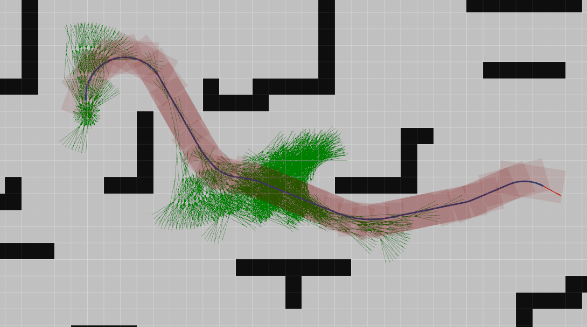

# planning-car
Some common planning algorithms for car

## map_server
ros集成源包
-> /map
配置文件里分辨率不要动，保持为1

## plan_env:
地图管理，提供操作地图的API

## esdf_2d:
将占据栅格地图转化为esdf地图，原理参考[FIESTA: Fast Incremental Euclidean Distance Fields for Online Motion Planning of Aerial Robots](https://arxiv.org/abs/1903.02144)

## a_star

运行：

    rosluanch a_star astar_demo.launch

使用2D Nav Goal点击地图即可，第一次是起点，第二次是终点

### hybrid_a_star
map中每个栅格不只取中心，而是包含很多状态($x,y,\phi$)，因此，每个大栅格会离散成一个三维($x,y,\phi$)栅格地图，拥有更精细的分辨率，grid_size_xy_和grid_size_phi_分别描述了每个大栅格中有几个小xy栅格和整体$\phi$维度栅格的个数
运行：

    roslaunch hybrid_a_star hybrid_astar_demo.launch

使用2D Nav Goal点击地图即可，第一次是起点，第二次是终点

效果：

TODO:
使用Astar优化Hybrid Astar扩展节点的速度，提供正确的扩展方向
开发2.5D的hybridA*算法
